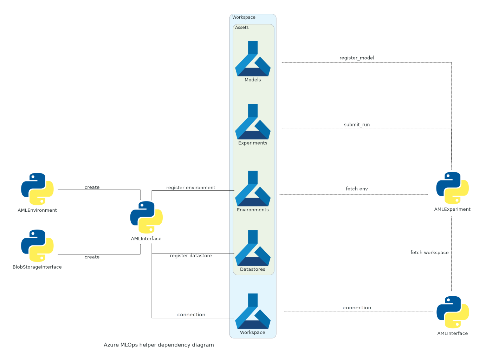

# The various steps needed to train a model on Azure.

We can divide the steps needed to train and deploy in the following order :

1. **Data creation/registration** : have some datas available in an Azure Blob Storage.
2. **Environment creation** : design and build the training environment as a Docker image.
3. **Experiment creation** : attach the datas and the environment to a provisioned compute instance and build the training loop or the training pipeline. Register the resulting model.
4. **Deploy the model** : For a simple model, deploy it to to a container instance or a Kubernetes cluster, and monitor it.

!!! info "Remark"

    The last point is only valid for **simple task** if youre model is a for example an ensemble model, or must be deployed in an API. You might to do some work by hand before automation.

The idea being that each of theses steps if defined by a class of this package, interacting with the [`AMLInterface`][azure_helper.utils.aml_interface] and each others.

## Diagram of dependances between the classes

