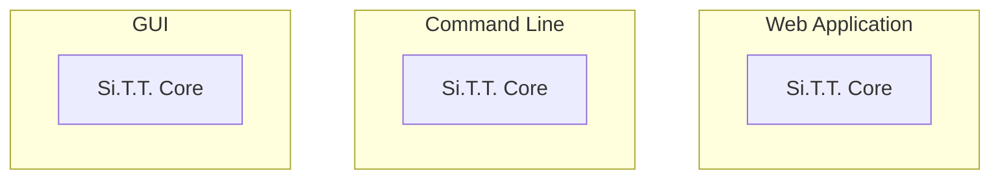
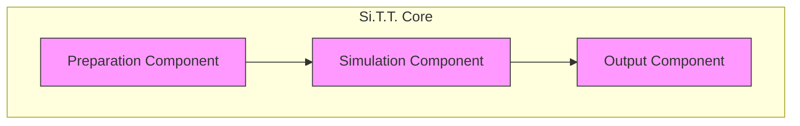
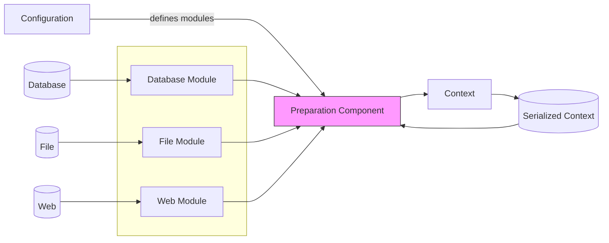
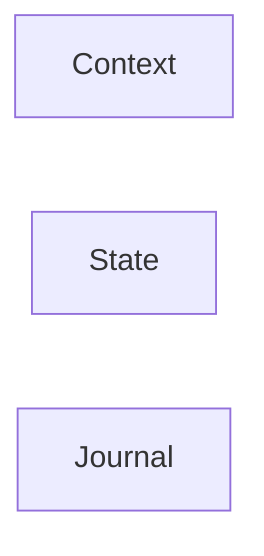
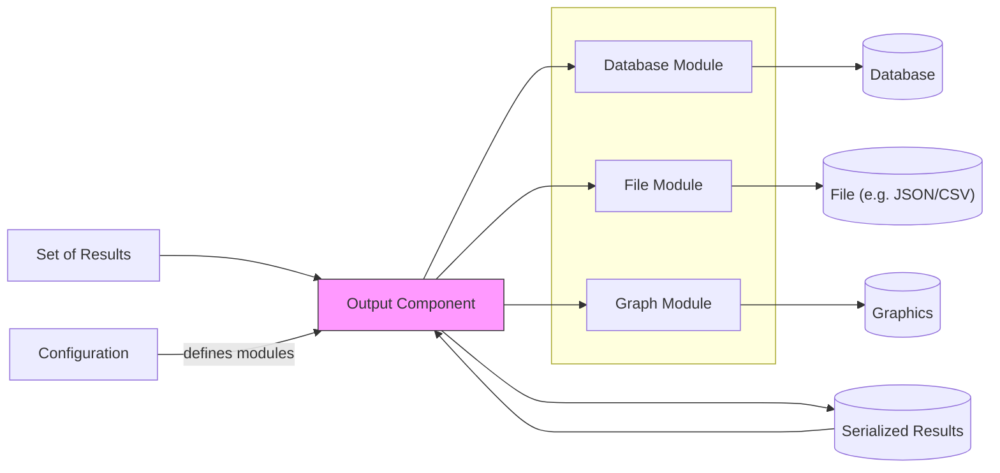

# Si.T.T. Application Concept

The following sections explain the basic concepts of the Si.T.T. application. The content is subject to change.

TODOs:
* License of application? See https://choosealicense.com/
* Server component to store data in? Should we use a Postgres server, for example? Makes sense, but will make the
  application dependent on a server component. Alternatively, we might have the user choose (e.g. SQLite or Postgres).
  Im Fall von SQLite könnte man SpatiaLite nehmen? Ist aber nicht ganz ohne zu verwenden...
  (https://gis.stackexchange.com/questions/184850/how-to-use-spatialite-functions-in-a-python-script)

## Modularity

Most components of Si.T.T. are modular. This means that they can be exchanged thus modifying the behavior of the
simulation. For example, the Preparation Component can handle different data sources such as databases, files,
or web sources. Modules are plain Python classes, and it is easy to create new classes.

## Si.T.T. Core

The main simulation program code is called *Si.T.T. Core*. The core takes arguments defined by some *configuration*.
After running, it returns data in a format that can be read and presented by other applications. Si.T.T. Core is designed
to be run as part of other applications, e.g. as part of a website (e.g. in a Django application), as a command line
programm or within one that presents a nice GUI (graphical user interface).



The core consists of three components:



* The **Preparation Component** consists of modules that read data from data sources and convert them into a
  format that can be read by the simulation.
    * The output of this component is called the *Context*. The context will contain static data like
      possible routes including height profiles, route type (road, stream, etc.), weather data, data on fatigue and
      whatever additional information makes sense). Some data will also exist as dynamic web endpoints.
* The **Simulation Component** runs the actual simulation. A number of virtual agents will traverse possible routes.
  An agent does not need to represent a person. In a trade network, an agent is more likely to be a load of cargo.
  They will take data from the context (read only) and create a state for each agent. Modules in the simulation will
  be called during each step of the simulation reading and modifying the state.
    * The *State* represents the current data of a particular agent within a given step of the simulation. It contains
      the time and position of the agent plus additional generic data defined by the simulation modules. Fatigue, load,
      mode of transport, and other information can be contained in the state.
    * Simulation modules are the core code blocks that define how the simulation behaves. It is easy to change and
      reorder these modules.
    * After all agents have finished, a *Set of Results* is created.
* The **Output Component** will take the set of results and will call its modules to output or present these in some
  meaningful way. Possible outputs are data written into a database, a set of graphs, or a spreadsheet.

All components are set and defined by the *Configuration*, a set of data and rules defined before running the core
which define which modules to load and what presets to assume.

The following diagram shows the basic constituents of the software:

```mermaid
flowchart TB
APP([Application])

CONF["Configuration"]
SRC[("Data Source(s)")]
OUTPUT[Output]

subgraph CORE [Si.T.T. Core]
    IN["Preparation Component"]
    subgraph SIM["Simulation Component"]
        subgraph AGENT["any number of Agents"]
            STATE["State"]
            ITER["Iteration"]
            
            STATE <-->|exchange data| ITER
            ITER -->|n times| ITER
        end
    end
    OUT["Output Component"]
    
    CONTEXT[Context]
    RESULT[Set of Results]
    
    IN -- creates --> CONTEXT -- read by --> SIM -- creates --> RESULT -- parsed by --> OUT
end

CONF -- sets --> CORE
SRC -- read into --> IN
OUT -- creates --> OUTPUT
APP -- runs --> CORE
APP -- defines --> CONF

classDef module fill:#f9f,stroke:#333,color:#333;
class IN,SIM,OUT module;
style APP fill:#5F9EA0,color:#fff;
```


## Configuration

The configuration can be defined using any of these methods:

* programmatically
* from YAML
* from command line parameters

Consequently, the configuration can be defined by another program, or running a wrapper on the command line or within
a Jupyter notebook. Core of the configuration will be config loader, probably based on either
[jsonargparse](https://jsonargparse.readthedocs.io/en/latest/) or [Click](https://click.palletsprojects.com/en/8.1.x/).


## Preparation Component

The Preparation Component's task is to fetch data from different sources and aggregate it into a context object
that is passed to the simulation. This is done by using specific modules. Each module is specialized on importing data
from a different source. New modules can easily be written in order to add new sources. All data will be collected in
the context object. The context object can also be serialized and saved to a file, so subsequent runs of the simulation
do not have to re-create the context over and over again.



The context will aggregate things like:

* means of transport
* possible routes
* landscape model
* possibly precalculated route variants (precalculation can be done using a module, too)
* weather data
* fatigue model
* presumptions such as starting place, target location, starting time, load, etc.
* ... other data relevant for simulation models


## Simulation Component

_TODO:_ It might be better to precalculate all possible routes first - this will make agent cloning superfluous and
therefore reduce complexity a bit...

_TODO:_: Check nodes and merges - at which points along the route can decisions be taken? And what decisions do we need
to take case of?

This is the core worker. It will run a list of configured modules each iteration and calculate times and distances
travelled by an agent. The basic simulation runs like this:

* An agent is created. The agent will receive the context and initialize its state. The state represents the current
  information on the agents and contains data such as:
  * current position
  * current time
  * length taken for the next leg of the journey (see below)
  * current fatigue, load, means of transport, and other information relevant for the simulation
* Each agent will also have a journal of past states. This can be used to reconstruct all the iterations taken by the
  agent. Because agents can be cloned and merged, the journal will be a graph, containing possible detours and merges.
* The simulation will run any number of steps until the agent reaches the target position or a special exception will
  be raised by a module (`AgentRetiredException`). An actual simulation iteration will look like this:
  * If there are multiple routes available at the current position, the agent will clone into multiple agents equal to
    the number of routes. Each agent will have its own copy of the state and will receive the global context (which is
    read only). The means of transport can also change due to different routes (e.g. changing from land transport to
    water). There will be modules to handle this.
  * For each agent, the simulation will calculate the next day's journey. It is important to precalculate this,
    because multiple agents might end up at the same base camp at night due to restrictions where to stay overnight.
    As a consequence, the number of agents might have to be reduced after the day has passed.
  * The iteration of a day will be cut into any number of steps (for each agent):
    * The next possible leg of the route will be taken and the length of time for this path will be calculated.
    * The calculation will call any number of modules (using events such as `on_before_run`, `on_run`, and
      `on_after_run`). Each call can modify the state, especially to calculate the time taken for the next section of the
      journey. Each module can also save arbitrary data into the state that can be read and interpreted by other modules,
      which makes it possible for modules to react somehow. Moreover, each module has access to all the data in the
      context, so it can retrieve the weather data, fatigue model, etc. from it. As a consequence, modules can be very
      flexible and regards things like:
      * weather
      * load and means of transport
      * change the means of transport
    * Calculations can also signal a "zero advancement" event, meaning that for a certain time, there will be no further
      advancement along the path. This enables modules to simulate (forced) breaks.
      * Moreover, some points might be "mandatory stops" (e.g. trade hubs where cargo is always unloaded and checked).
        These can be simulated by similar means: Reducing travel to just reach this point.
    * After all the models have run, the time taken for the next leg will be evaluated:
      * If the remaining time for this day is longer than the time taken, the agent will advance to the new position.
      * Otherwise, the day will end and the agent will retire for the night at the last possible overnight stay (using
        the journal).
    * After each step, it is possible to clone the agent according to possible routes. This can also mean a change in
      the means of transport. There will be modules to handle this.
  * Thus, each iteration will calculate the times taken to the next overnight position.
  * After all the steps have been concluded, the simulation checks for double agents at the same target position. If
    there are any, the number of agents will be reduced (the best matching agent will be taken).
  * All remaining agents' state will advance to the new positions and the times will be incremented.
* For each agent, the iteration will continue in parallel (possibly using something like `concurrent.futures` in
  Python).
* After all the agents have finished their journey, the set of results will be created. This is a list of all the
  agents, including their states and their journals. The set of results also contains the original context.

_TODO_ diagrams

Parallelism: Possible by day, as far as I can see now.

Agents deduplication can be checked after a day has ended. Thus, threads can run in parallel for each day, after which
all agents are evaluated. Merging of agents on the basis of certain variables that identify a unique agent (like a
hash). The total number of agents will be reduced, if duplicates are found (like a tree shaking process). The journal
of merged agents has to be merged, too.




## Output Component

The output component is the opposite of the input one: It will render the set of results into some other format using
modules. Again, each module can be specialized to export specific formats or send it to specific targets. Serialization
of the plain result data is also supported, so it can be reloaded by the output component later on, too.



* Lizenzen: https://choosealicense.com/
* Struktur: https://docs.python-guide.org/writing/structure/
